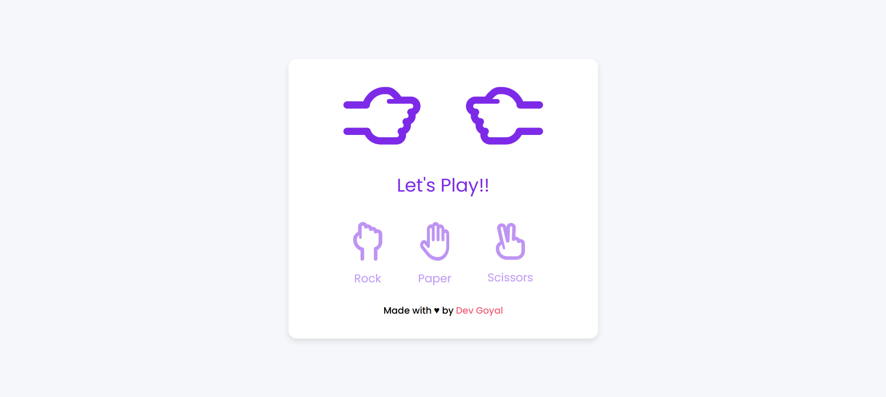

[](https://github.com/DevGoyalG)
[](https://github.com/DevGoyalG?tab=repositories)


<h1 align="center"> Rock Paper Scissors Game </h1>

<p align="center"> <b> If you found this repository helpful, give us a  ⭐️ </b> </p>
<p align="center"></a> </p>

A simple and interactive Rock Paper Scissors Game where you can play against the computer. The game allows you to choose between rock, paper, or scissors, and the computer will randomly select its choice. The result is then displayed, showing whether you won, lost, or tied.

## 🌐 Live Demo
Check out the live demo of the Rock Paper Scissors Game [here](https://rock-paper-scissors-play.netlify.app/).

## 📸 Project Preview
Here's a sneak peek of the Rock Paper Scissors Game:



## 🚀 Features
- Allows you to play Rock, Paper, Scissors against the computer.
- Displays the result of each round: Win, Lose, or Tie.
- Tracks and displays your score (number of wins).
- Simple and responsive design, perfect for both desktop and mobile.

## 🛠️ Tech Stack
- **HTML** : For the structure of the game interface.
- **CSS** : For styling the page and creating the game’s layout.
- **JavaScript** : For the game logic, handling user input, and generating random computer choices.

## 🧑‍💻 Getting Started

Follow the steps below to clone and use the project locally:

### 1. Prerequisites
Make sure you have **Git** installed. If not, you can download it [here](https://git-scm.com/).

### 2. Clone the Repository
```bash
git clone https://github.com/DevGoyalG/Rock-Paper-Scissors-Game.git
```

## 🤝 Contributing
Contributions are welcome! If you have suggestions or want to report an issue, feel free to open an issue or create a pull request.

## 👨‍💻 Created by
This project was created and is maintained by:
**Dev Goyal**

Feel free to reach out if you have any questions or suggestions! ❤️
